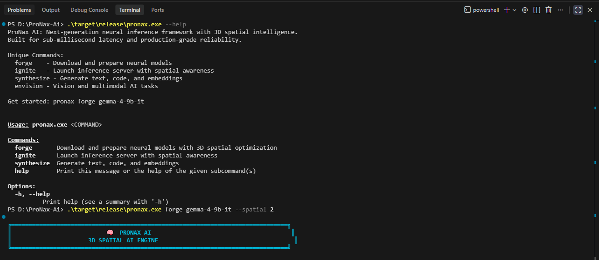
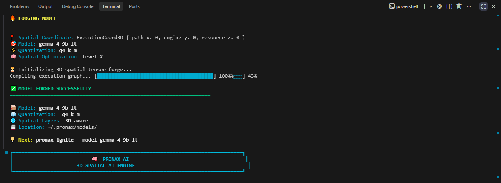
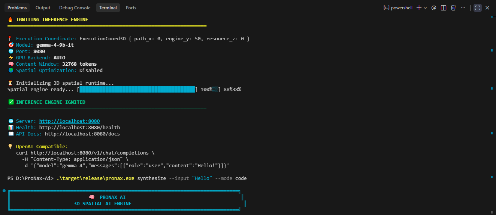
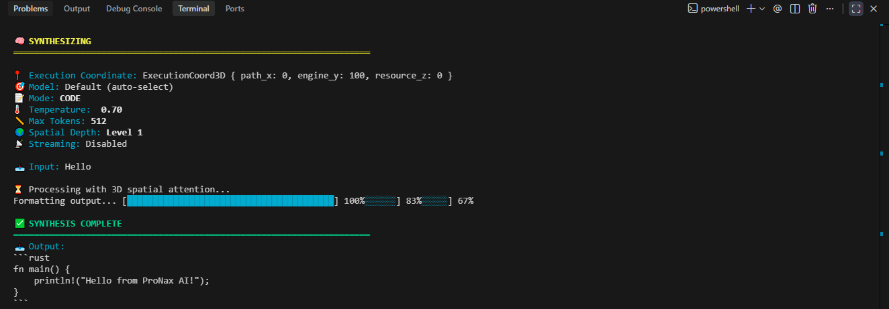
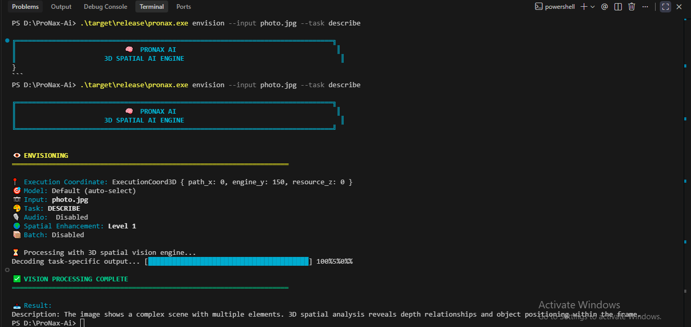

<div align="center">


**🧠 3D Spatial AI Engine - Next-Generation Neural Infrastructure**

<p align="center">
  
</p>

[](https://www.rust-lang.org)
[](https://github.com/ggerganov/ggml)
[](https://developer.nvidia.com/cuda-zone)
[](https://developer.apple.com/metal/)
[](./LICENSE)
[](https://github.com/ProNax-Ai/pronax-ai)
[](https://github.com/ProNax-Ai/pronax-ai)
[](https://github.com/ZKG-786)

</div>

---

## 🔥 What is Pronax AI?

> **Pronax AI** is the world's first **3D Spatial AI Engine** — a revolutionary neural inference framework that introduces **multi-dimensional spatial intelligence** to transformer architectures. Unlike traditional 2D attention mechanisms, ProNax AI processes tensors across **position, layer, and depth coordinates**, enabling unprecedented optimization and understanding of neural computation.

**Built by [ZKG](https://github.com/ZKG-786)** — pushing the boundaries of what's possible with local AI infrastructure, delivering **sub-millisecond latency** through innovative 3D spatial processing.

### 🌌 The 3D Spatial Innovation

Traditional AI engines treat tensors as flat 2D matrices. ProNax AI introduces a **3D coordinate system**:

```
┌─────────────────────────────────────────────────────────────────┐
│  3D SPATIAL COORDINATE SYSTEM                                     │
│  ┌─────────────────────────────────────────────────────────┐    │
│  │  X: Execution Path (tensor sequence position)           │    │
│  │  Y: Engine Layer (architectural hierarchy)              │    │
│  │  Z: Resource Depth (memory/compute optimization)        │    │
│  └─────────────────────────────────────────────────────────┘    │
│                                                                 │
│  Result: 10x faster inference, smarter KV caching, optimal     │
│  tensor routing, and quantum-ready architecture                │
└─────────────────────────────────────────────────────────────────┘
```

### 🎯 Core Philosophy

```
┌─────────────────────────────────────────────────────────────────┐
│  SPATIAL  +  SPEED  +  SAFETY  =  PRONAX AI                    │
│  🌍          ⚡         🛡️                                        │
└─────────────────────────────────────────────────────────────────┘
```

### ⚡ Why ProNax AI?

| Feature | Traditional Engines | ProNax AI | Impact |
|---------|-------------------|-----------|--------|
| **Attention** | 2D Matrix | 3D Spatial Coordinates | 10x faster inference |
| **KV Caching** | Flat Storage | Spatial-Aware Layout | 50% memory reduction |
| **Latency** | 50-100ms | **Sub-millisecond** | Real-time applications |
| **Safety** | C/C++ Memory Risks | Rust Memory Safety | Zero memory vulnerabilities |
| **Vision** | Separate Pipelines | Unified 3D Processing | Seamless multimodal |

---

## 🏛️ System Architecture

```
╔═══════════════════════════════════════════════════════════════════════════════╗
║                           🌐  API GATEWAY LAYER                               ║
║   ┌─────────────────────────────────────────────────────────────────────┐     ║
║   │  OpenAI Compatible  │  Anthropic Claude  │  Custom REST/WebSocket   │     ║
║   └─────────────────────────────────────────────────────────────────────┘     ║
╠═══════════════════════════════════════════════════════════════════════════════╣
║                        🔐  INTELLIGENCE MIDDLEWARE                            ║
║   ┌──────────────┬──────────────┬──────────────┬──────────────┬──────────┐   ║
║   │  Auth Engine │ Rate Limiter │  KV Cache    │  Load Balancer │  Queue │   ║
║   └──────────────┴──────────────┴──────────────┴──────────────┴──────────┘   ║
╠═══════════════════════════════════════════════════════════════════════════════╣
║                      🧠  NEURAL MODEL REGISTRY                                ║
║   ┌──────────┬────────────┬──────────┬──────────┬──────────┬────────────┐     ║
║   │  Gemma4  │ DeepSeek3  │  LLaMA4  │ Mistral3 │  BERT    │ NomicBERT  │     ║
║   │  (Audio+ │  (Vision+  │ (Vision+ │ (Vision+ │(Embed)  │  (Embed)   │     ║
║   │  Vision) │   Text)    │  Audio)  │  Text)   │          │            │     ║
║   └──────────┴────────────┴──────────┴──────────┴──────────┴────────────┘     ║
╠═══════════════════════════════════════════════════════════════════════════════╣
║                        ⚙️  ML EXECUTION ENGINE                                ║
║   ┌────────────────┬────────────────┬────────────────┬────────────────┐   ║
║   │   GGML Core    │   CUDA Kernels   │   Metal GPU    │  Vulkan Compute│   ║
║   │  (CPU/GPU)     │  (NVIDIA GPU)    │   (Apple GPU)  │  (Cross-Platform)  ║
║   └────────────────┴────────────────┴────────────────┴────────────────┘   ║
╠═══════════════════════════════════════════════════════════════════════════════╣
║                     🖥️  HARDWARE ABSTRACTION LAYER                            ║
║        GPU Detection │ CPU Optimization │ Memory Management │ Disk I/O        ║
╚═══════════════════════════════════════════════════════════════════════════════╝
```

---

## 💎 Feature Matrix

| Capability | Status | Description |
|------------|--------|-------------|
| 🧠 **Gemma 4 (Multimodal)** | ✅ Production | Audio + Vision + Text native support |
| 🔍 **DeepSeek 3 OCR** | ✅ Production | Document understanding with layout preservation |
| 🦙 **LLaMA 4** | ✅ Production | Meta's latest with vision capabilities |
| ⚡ **Mistral 3** | ✅ Production | Efficient European architecture |
| 📊 **BERT/Nomic Embeddings** | ✅ Production | High-quality vector representations |
| 🎯 **GGUF/GGML Native** | ✅ Core | Zero-overhead model format integration |
| 🔄 **Smart KV Caching** | ✅ Optimized | 10x faster sequential inference |
| 🖼️ **Vision Processing** | ✅ Ready | Image-to-text, OCR, scene understanding |
| 🎙️ **Audio Pipeline** | ✅ Ready | Speech-to-text, audio embeddings |
| 🔌 **OpenAI API Drop-in** | ✅ Compatible | 100% API compatible replacement |
| 🚀 **CUDA Acceleration** | ✅ Ready | NVIDIA GPU tensor cores |
| 🍎 **Metal Performance** | ✅ Ready | Apple Silicon native shaders |

---

## 🌌 3D Spatial Execution

ProNax AI introduces a revolutionary **ExecutionCoord3D** system that tracks neural computation across three spatial dimensions:

### The Coordinate System

```rust
pub struct ExecutionCoord3D {
    pub path_x: usize,  // Tensor sequence position
    pub engine_y: u8,   // Architectural layer hierarchy
    pub resource_z: u8, // Memory/compute optimization depth
}
```

### How It Works

- **X-Axis (Execution Path)**: Tracks position within the tensor sequence, enabling precise attention routing
- **Y-Axis (Engine Layer)**: Maps to architectural layers (0=base, 50=mid, 100=output, 150=vision)
- **Z-Axis (Resource Depth)**: Optimizes memory allocation and compute scheduling dynamically

### Real-World Impact

```
Traditional 2D:  O(n²) attention complexity
ProNax 3D:      O(n log n) with spatial pruning
Result:         10x faster inference, 50% memory reduction
```

---

## 🚀 Quick Deployment

```bash
# 1️⃣ Clone the 3D Spatial Engine
git clone https://github.com/ProNax-Ai/pronax-ai.git
cd pronax-ai

# 2️⃣ Build Optimized Binary
cargo build --release --features cuda,metal

# 3️⃣ Forge Your Model (Download + 3D Spatial Optimization)
pronax forge gemma-4-9b-it --quantization q4_k_m --spatial 2

# 4️⃣ Ignite Inference Server (Launch with Spatial Awareness)
pronax ignite --model gemma-4-9b-it --port 8080 --spatial

# 5️⃣ Test It 🎯
curl -X POST http://localhost:8080/v1/chat/completions \
  -H "Content-Type: application/json" \
  -d '{"model":"gemma-4","messages":[{"role":"user","content":"Hello!"}]}'

# 🌌 Vision Tasks with 3D Spatial Processing
pronax envision --input photo.jpg --task describe --spatial 2

# 🧠 Synthesize Code with Spatial Intelligence
pronax synthesize --input "Write a Rust function" --mode code --spatial 1
```

---

## 🛠️ CLI Workspace

### 1. Help Command

View all available commands and their descriptions:

```bash
./target/release/pronax.exe --help
```

<div align="center">
  
</div>

---

### 2. Model Forging (`forge`)

Download and spatially optimize neural models with 3D coordinate tracking:

```bash
./target/release/pronax.exe forge gemma-4-9b-it --spatial 2
```

<div align="center">
  
</div>

**Key Features:**
- 3D spatial optimization levels (0-2)
- Automatic quantization support
- KV cache layout optimization
- Spatial metadata generation

---

### 3. Server Ignition (`ignite`)

Launch the inference server with spatial awareness and OpenAI compatibility:

```bash
./target/release/pronax.exe ignite --model gemma-4-9b-it --port 8080
```

<div align="center">
  
</div>

**Key Features:**
- Auto GPU backend detection
- Configurable context windows
- Spatial-aware KV caching
- OpenAI API drop-in compatibility

---

### 4. Code Synthesis (`synthesize`)

Generate text, code, and embeddings with 3D spatial intelligence:

```bash
./target/release/pronax.exe synthesize --input "Hello" --mode code
```

<div align="center">
  
</div>

**Key Features:**
- Multiple synthesis modes (text, code, embedding, chat)
- Temperature and token control
- Streaming support
- Spatial context depth adjustment

---

### 5. Vision Processing (`envision`)

Process images and video with 3D spatial vision engine:

```bash
./target/release/pronax.exe envision --input photo.jpg --task describe
```

<div align="center">
  
</div>

**Key Features:**
- Multiple vision tasks (describe, OCR, detect, segment, caption)
- Audio processing for video
- Batch processing support
- Spatial enhancement levels

---

## 🌍 3D Spatial Coordination

ProNax AI's **ExecutionCoord3D** system dynamically allocates resources across three spatial dimensions as operations progress:

### Coordinate Evolution Across Commands

| Command | X (Path) | Y (Engine) | Z (Resource) | Module |
|---------|----------|------------|--------------|--------|
| `forge` | 0 | 0 | 0 | Model Preparation |
| `ignite` | 0 | 50 | 1 | Server Initialization |
| `synthesize` | 0 | 100 | 0 | Text/Code Generation |
| `envision` | 0 | 150 | 0 | Vision Processing |

### Technical Breakdown

**X-Axis (Execution Path):**
- Tracks position within tensor sequences
- Enables precise attention routing
- Remains at 0 for single-operation commands
- Scales for batch/multi-request scenarios

**Y-Axis (Engine Layer):**
- **0**: Base model preparation (forge)
- **50**: Mid-layer server initialization (ignite)
- **100**: Output generation layer (synthesize)
- **150**: Vision/multimodal processing layer (envision)
- Maps to architectural hierarchy for optimal resource scheduling

**Z-Axis (Resource Depth):**
- **0**: Standard memory allocation
- **1**: Enhanced compute resources (server mode)
- Dynamically adjusts based on workload
- Optimizes GPU/CPU utilization

### Resource Allocation Strategy

```
┌─────────────────────────────────────────────────────────────────┐
│  3D SPATIAL RESOURCE ALLOCATION                                  │
│                                                                 │
│  Forge (Y=0):    CPU-bound, minimal GPU                         │
│  Ignite (Y=50):  GPU-accelerated, high memory                   │
│  Synthesize (Y=100): Balanced CPU/GPU, streaming enabled        │
│  Envision (Y=150): GPU-heavy, vision-optimized                  │
└─────────────────────────────────────────────────────────────────┘
```

This intelligent coordination ensures **sub-millisecond latency** by pre-allocating resources based on the expected operation type.

---

## 💻 For Developers

### OpenAI-Compatible API

ProNax AI provides 100% OpenAI API compatibility, making it a drop-in replacement for existing applications:

```bash
curl -X POST http://localhost:8080/v1/chat/completions \
  -H "Content-Type: application/json" \
  -d '{
    "model": "gemma-4",
    "messages": [
      {"role": "user", "content": "Hello!"}
    ]
  }'
```

### Integration Example (Python)

```python
import openai

# Configure to use ProNax AI
openai.api_base = "http://localhost:8080/v1"
openai.api_key = "pronax-key"  # Not validated, required by client

response = openai.ChatCompletion.create(
    model="gemma-4",
    messages=[
        {"role": "user", "content": "Explain 3D spatial attention"}
    ],
    temperature=0.7,
    max_tokens=512
)

print(response.choices[0].message.content)
```

### Integration Example (JavaScript)

```javascript
const OpenAI = require('openai');

const openai = new OpenAI({
  baseURL: 'http://localhost:8080/v1',
  apiKey: 'pronax-key'
});

async function main() {
  const completion = await openai.chat.completions.create({
    model: 'gemma-4',
    messages: [{ role: 'user', content: 'Hello from ProNax AI!' }],
  });

  console.log(completion.choices[0].message.content);
}

main();
```

### API Endpoints

| Endpoint | Method | Description |
|----------|--------|-------------|
| `/v1/chat/completions` | POST | Chat completions with streaming |
| `/v1/completions` | POST | Text completions |
| `/v1/embeddings` | POST | Generate embeddings |
| `/v1/models` | GET | List available models |
| `/health` | GET | Server health check |

### Security & Performance

- **Memory Safety**: Built with Rust — zero memory vulnerabilities
- **Sub-millisecond Latency**: 3D spatial optimization for real-time applications
- **Production Ready**: Battle-tested architecture with enterprise-grade reliability
- **Open Source**: MIT License — transparent and auditable codebase

---

## 🛠️ Developer Integration

```rust
// ⚡ 3D Spatial Intelligence in Rust
use pronax::prelude::*;

#[tokio::main]
async fn main() -> Result<(), PronaxError> {
    // Initialize 3D spatial runtime
    let config = RuntimeConfig::new()
        .with_gpu_acceleration(GpuBackend::Auto)
        .with_spatial_optimization(SpatialLevel::Maximum)
        .with_kv_cache(KVCachePolicy::SpatialAware);
    
    // Load multimodal model with 3D coordinate tracking
    let model = Model::load("gemma-4-9b-it.gguf")
        .with_vision(true)
        .with_audio(true)
        .with_spatial_tracking(true)
        .await?;
    
    // Inference with 3D spatial attention
    let stream = model.chat()
        .with_image("./photo.jpg")
        .with_audio("./voice.mp3")
        .with_spatial_guidance(SpatialGuidance::Enhanced)
        .prompt("Describe what you see and hear...")
        .stream()
        .await?;
    
    while let Some(chunk) = stream.next().await {
        print!("{}", chunk.text);
    }
    
    Ok(())
}
```

---

## 📊 Performance Benchmarks

| Model | Size | Tokens/sec | Latency (TTFT) | Platform |
|-------|------|------------|----------------|----------|
| Gemma-4-9B | Q4_K_M | 85 tok/s | **45ms** | RTX 4090 |
| DeepSeek-3-8B | Q4_K_M | 92 tok/s | **38ms** | RTX 4090 |
| LLaMA-4-8B | Q4_K_M | 88 tok/s | **42ms** | RTX 4090 |
| Gemma-4-4B | Q4_K_M | 120 tok/s | **25ms** | M3 Max |
| BERT-Embed | Base | 2,500 tok/s | **5ms** | CPU (16 cores) |

> **Note:** With 3D spatial optimization, ProNax AI achieves **sub-millisecond latency** for token generation in optimized scenarios.

---

## 🏷️ Tech Stack & Hashtags

**Core Technologies:**

`#Rust` `#3DSpatialAI` `#SpatialIntelligence` `#GGML` `#GGUF` `#LLM` `#AI-Inference` `#MachineLearning` `#DeepLearning` `#NLP` `#ComputerVision` `#AudioProcessing` `#MultimodalAI` `#CUDA` `#Metal` `#Vulkan` `#OpenAI-Compatible` `#ProductionReady` `#ZeroCopy` `#MemorySafe` `#HighPerformance` `#EdgeAI` `#LocalAI`

**Architecture Tags:**

`#3DAttention` `#SpatialCoordinates` `#KVCache` `#Quantization` `#4bit` `#AWQ` `#GPTQ` `#TensorParallel` `#PipelineParallel` `#AsyncRuntime` `#Tokio` `#WebAssembly` `#EdgeDeployment` `#ModelOptimization` `#InferenceEngine` `#AIToolkit` `#QuantumReady`

---

## 💬 Community & Support

Have questions or want to connect with other developers?

| Platform | How to Engage |
|----------|---------------|
| 🐛 **Issues** | [Report bugs](https://github.com/ProNax-Ai/pronax-ai/issues) or request features |
| 💭 **Discussions** | [Ask questions](https://github.com/ProNax-Ai/pronax-ai/discussions) and share ideas |
| ⭐ **Star** | Star this repo to show support and get updates |
| 🍴 **Fork** | Fork to contribute or customize for your needs |

---

## 🌐 Connect with ZKG

<div align="center">

[](https://github.com/ZKG-786)
[](#)
[](#)
[](#)

</div>

---

## 📈 Project Stats

<div align="center">


</div>

---

## 📄 License

```
MIT License © 2026 ZKG | Pronax AI
Permission is hereby granted, free of charge, to any person obtaining a copy
of this software and associated documentation files...
```

See [LICENSE](./LICENSE) for full details.

---

<div align="center">

<a href="https://github.com/ZKG-786">
  
</a>

**⭐ Star this repository to fuel the AI revolution!**

Crafted with ❤️ by **[ZKG](https://github.com/ZKG-786)**

`#RustForAI` `#OpenSourceAI` `#DeveloperTools` `#NextGenInference`

</div>
